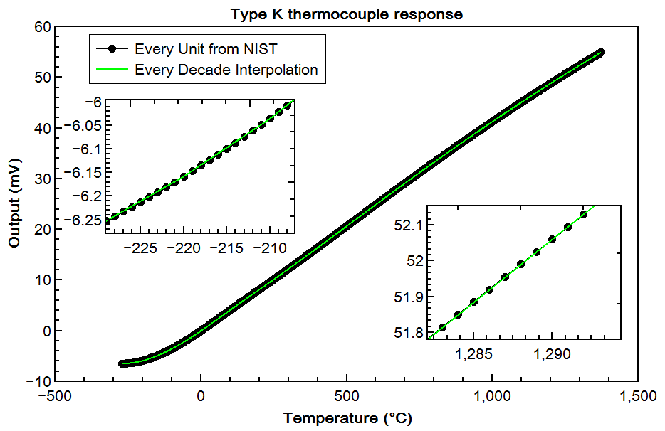

# thermocouples
Python library of random things dealing with thermocouples.

## Type K
Linear interpolation from a table is a standard way to convert from temperature to voltage and back for thermocouples. Strangely I could not find a python library that does that, so I made one.

Type K thermocouples are pretty linear on a small scale. For any 10 degree C range, the slope can be described very well with a linear function. The file `typek.py` uses [the values from NIST](https://srdata.nist.gov/its90/download/type_k.tab) at every 10 degrees, and uses linear interpolation to calculate the values in between. This results in a very fast, small library to calculate the temperature from a type K thermocouple given the cold junction temperature and the voltage from the thermocouple. 

```python
import typek
temp_C = typek.get_temp(cold_junction_temp_C, thermocouple_millivolts)
```

Compared to the full set of values from NIST (included as `nist_typek.py`), the interpolation works very well:



And the error is well below what most ADC's can measure, and is therefore negligible. For example, [my 16-bit ADC](https://github.com/jonathanimb/ADS1118) with a range of ±0.256 volts measures 7.8 microvolts per bit (theoretical measurement increment), plus some instrumental noise. 

Using the same graph from above and subtracting the unit value from the interpolated value shows a maximum error of 3 microvolts at the extremes, and less than 1 microvolt for normal use. At room temperature, that equates to an error of about 0.00002 °C. Note that the accuracy of a type K is about ±1.5 °C. 


